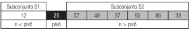
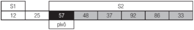
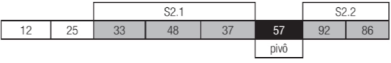
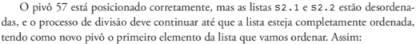
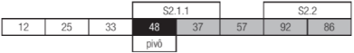
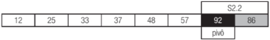
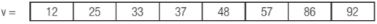
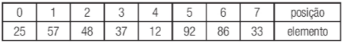
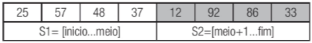

# Busca e ordenação

A ordenação é um recurso que consiste em rearranjar um conjunto de elementos,
de acordo com uma determinada ordem, que pode ser crescente ou decrescente, com
o objetivo de facilitar a busca de um elemento.

A busca é uma operação que compreende a localização de um elemento, em um
dado conjunto, e a sua recuperação, isto é, sua disponibilização para manipulação.

O princípio da ordenação é aplicado para a melhoria da busca de dados mesmo
antes do advento da computação.

## 10.2 O método Bolha

Bubble Sort, realiza a ordenação comparando os elementos, dois a dois, e trocando-os de posição, de acordo com o critério estabelecido de ordem crescente ou decrescente. Seu nome se deve à ideia de que os elementos vão “subindo” para as posições corretas, como bolhas.

O método Bolha pode ser implementado de forma iterativa, em que a execução
das instruções ocorre sucessivamente, controlada por estruturas de laço, ou recursiva, por meio de chamadas à própria função.

EXEMPLO 10.1

Algoritmo iterative para ordenação de um conjunto de números inteiros pelo método
Bolha.

**Pseudocódigo:**

```
1. Função Bolhalterativa(v: vetor[0..n] de inteiros): vetor de inteiros
2. Var
3.      i, j, aux: inteiro
4. Início
5.      Para j <- n até j >= 1 passo -1 faça
6.          Para i <- 0 até i < j passo 1 faça
7.              Se (v[i] > v[i+l]) então
8.                  aux <- v[i]
9.                  v[i] - v[i+l]
10.                 v[i+l] «- aux;
11.             Fim-Se
12.         Fim-Para
13.     Fim-Para
14.     Retornar v
15. Fim Bolhalterativa
```

O algoritmo deve possuir dois laços de iteração para garantir que todos os valores sejam comparados e ordenados.

O primeiro laço, a estrutura Para da linha 5, **Variável j** é usada para controlar o número de iterações necessárias em função do tamanho do vetor.

O segundo laço, que vai da linha 6 até a 12, é utilizado para percorrer o vetor, da primeira até a penúltima posição.

E importante observar que, ao término da primeira iteração do laço da linha 6, o maior
número do vetor é deslocado para a última posição, de forma que, no próximo passo, não é
mais necessário fazer a verificação deste elemento, motivo pelo qual i varia de 0 até i < j.
O número de elementos que precisam ser comparados é reduzido à medida que j também diminui, ou os elementos de maior valor são colocados em suas posições.

**Código em C# no arquivo \BubbleShort**

## 10.3 Estratégia Dividir para Conquistar

O conjunto é desmembrado em vários subconjuntos e cada um é ornedado recursivamente. Quando todos os subconjuntos estão ordenados, são feitas combinações entre os subconjuntos, até que se tenha a solução de ordenação para todos os elementos.

Os passos envolvidos nesta estratégia são:

1 -Dividir o conjunto de valores em subconjuntos menores.

2 - Ordenar os conjuntos menores (subconjuntos) recursivamente.

3 - Combinar os resultados dos subconjuntos, compondo a solução do conjunto total.

### 10.3.1 Ordenação por troca de partição - Quicksort

O Quicksort é baseado no paradigma “dividir para conquistar”, e o conjunto de valores é dividido em subconjuntos menores, denominados partições. Para proceder à divisão das partições, escolhe-se um elemento denominado pivô, dispondo todos os menores do que ele à esquerda e os maiores à direita, considerando a ordem crescente.

Tomando como exemplo o vetor v a seguir e qualificando o primeiro elemento do conjunto como pivô (o número 25), temos:

| 25 | 57 | 48 | 37 | 12 | 92 | 86 | 33
| ---- |  ---- | ---- | ---- | ---- | ---- | ---- | ---- |
| pivô |

O próximo passo consisteem colocar o pivô na posição correta, de modo que todosos números (n) menores do que ele fiquem à esquerda e os maiores, à direita, da seguinte maneira:



O subconjunto s 1 tem um único elemento e, desta forma, já está ordenado. Já o subconjunto S2 está fora de ordem e, para ordená-lo, vamos dividi-lo a partir de um novo pivô, que é o primeiro valor do subconjunto S2, no exemplo, o número 57. Veja:



O pivô 57 deve ser posicionado de maneira que, à sua esquerda, estejam os valores menores (S2.1) e à direita, os maiores (S2.2):



O pivô 57 está posicionado corretamente, mas as listas S2.1 e S2.2 estão desordenadas, e o processo de divisão deve continuar até que a lista esteja completamente ordenada,
tendo como novo pivô o primeiro elemento da lista que vamos ordenar. Assim:



A lista S2.1, decorrente da partição realizada em função do elemento de número 57, não precisa ser arranjada, visto que não existem números menores que o pivô e os maiores já estão à direita.
A nova lista deve ser, então, considerada a que denominamos S2.1.1, cujo pivô é o
número 48, equivalente ao primeiro elemento.



Organizada, a lista S2.1.1 fica como representado a seguir, com o número 37 à esquerda do pivô (48). A última lista que precisa ser arranjada é a S2.2, cujo pivô é o elemento de número 92.



Após a operação de partição, a lista S2.2 finaliza o processo, resultando no vetor a seguir:



**EXEMPLO 10.3**

Algoritmo segundo o método Quicksort para ordenação de um vetor de números inteiros.

**Pseudocódigo:**

```
1. Procedimento Quicksort(primeiro,ultimo: inteiro, v: vetor[0..n] de inteiros)
2. Var
3.      x: inteiro
4. Inicio
5.      Se (primeiro < ultimo) então
6.          x <- Particao(primeiro, ultimo, v)
7.          Quicksort (primeiro, x - 1, v)
8.          Quicksort (x + 1, ultimo, v)
9.      Fim-Se
10. Fim Quicksort.
11. Função Particao(primeiro, ultimo: inteiro, v: vetor[0..n] de inteiros): inteiro
12. Var
13.     pivo, aux, i, j: inteiro
14. Início
15.     j <- ultimo
16.     pivo <- v[primeiro]
17.     Para(i <- ultimo até primeiro passo -1) faça
18.         Se (v[i] >= pivo) então
19.             aux -* v[j ]
20.             v[j] <- v[i]
21.             v[i] <- aux
22.             j - j - 1
23.         Fim-Se
24.     Fim-Para
25.     Retornar j + 1
26. Fim Particao.
```

O primeiro pivô é sempre o primeiro elemento do vetor[0].

**Código em C# no diretório \QuickSort**

### Ordenação por intercalação - MERGESORT

O Mergesort também utiliza o paradigma “dividir para conquistar”, “dividindo” o conjunto de dados em subconjuntos com a metade do tamanho, por meio de um processo recursivo, até que cada vetor tenha apenas um elemento, intercalando-os, posteriormente,
de forma ordenada (conquista), obtendo o resultado final.

Vamos considerar o vetor v:


Aplicando a primeira divisão do conjunto (inicio + fim / 2), temos, 0 + 7 / 2 = 3
(considerando apenas o resultado inteiro da divisão).



**EXEMPLO 10.4**
Método Mergesort para ordenação de um vetor de números inteiros.

**Pseudocódigo**
```
1. Procedimento Merge (a: vetor[0..n] de inteiros, inicio, meio, fim: inteiro)
2. Var
3.      n, b[n], i1, i2, j: inteiro
4. Início
5.      j <- o
6.      n <- fim - inicio + 1
7.      i1 <- inicio
8.      i2 <- meio + 1
9.      Enquanto (i1 <= meio .e. i2 <= fim) faça
10.         Se (a[i1] < a[i2]) então
11.             b[j] - a[i1]
12.             i1 - i1 + 1
13.         Senão
14.             b[j] <- a[i2]
15.             i2 <- i2 + 1
16.         Fim-Se
17.         j <- j + 1
18.     Fim-Enquanto
19.     Enquanto (i1 <= meio) faça
20.         b[j] <- a[i1]
21.         i1 <- i1 + 1
22.         j <- j + 1
23.     Fim-Enquanto
24.     Enquanto (i2 <= fim) faça
25.         b[j] <- a[i2]
26.         i2 <- i2 + 1
27.         j <- j + 1
28.     Fim-Enquanto
29.     Para (j de 0 até n - 1 passo +1) faça
30.         a[inicio + j] <- b[j]
31.     Fim-Para
32. Fim Merge.
33. ProcedimentoMergesort(a: vetor [0. .n] de inteiros, inicio, fim: inteiro)
34. Var
35.     meio: inteiro
36. Início
37.     Se (inicio = fim) então
38.         Retornar
39.     Fim-Se
40.     meio <- (inicio + fim) / 2
41.     MergeSort(a, inicio, meio)
42.     MergeSort(a, meio + 1, fim)
43.     Merge(a, inicio, meio, fim)
44. Fim MergeSort.
```

