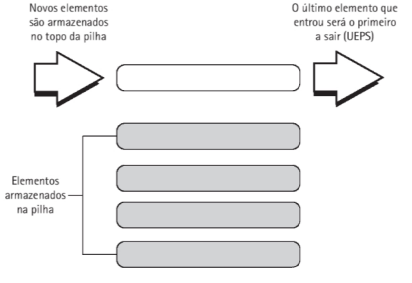

# 11 Estruturas do tipo Pilhas e Filas

Neste capítulo, a implementação das pilhas e filas ocorre por meio de vetores, como alternativa e de modo complementar ao assunto (discutido no Capítulo 6), porém, após o estudo das listas encadeadas, o estudante poderá facilmente adaptar os
exemplos aqui apresentados.

Pilhas, filas e listas encadeadas são, na verdade, listas de dados, cuja diferença principal está na forma de acesso à inclusão e remoção de seus elementos.

## 11.2 Estrutura do Tipo Pilha

As pilhas são estruturas de dados conhecidas como listas LIFO (Last Int First Out), em portugues UEPS;

Trata-se de uma lista linear em que todas as operações de inserção e remoção são feitas por um único extremo, denominado _topo_.

Um exemplo bastante comum que se aplica a este conceito é o de uma pilha de pratos guardada no armário. Quando a pessoa precisa de um prato, normalmente utiliza o que está no topo da pilha e quando vai guardá-lo, coloca-o igualmente no topo; tal fato acontece porque apenas uma das extremidades da pilha está acessível.



Operação de inserção de um elemento na pilha : **empilhar**
Operação de remoção ou exclusão: **desempilhar**

**EXEMPLO 11.1**
Algoritmo que representa uma pilha implementada com arranjo.

```
1. Algoritmo Exemplo11_1
2. Var
3.      Tipo pilha_reg = registro
4.          topo: inteiro
5.          elemento: vetor[0..n] de inteiros
6.      Fim_registro
7.      pilha: pilha_reg
8. Início
9.      pilha.topo <- -1 //instruções de manipulação omitidas
10. Fim.
11. Função PilhaVazia(): lógica
12. Início
13.     Se (pilha.topo = -1) então
14.         Retornar .v.
15.     Senão
16.         Retornar .f.
17.     Fim-Se
18. Fim PilhaVazia.
19. Função PilhaCheia(): lógica
20. Início
21.     Se (pilha.topo = n) então
22.         Retornar .v.
23.     Senão
24.         Retornar .f.
25.     Fim-Se
26. Fim PilhaCheia.
27. Procedimento Empilhar(elem: inteiro)
28. Início
29.     Se (.não. PilhaCheia()) então
30.         pilha.topo - pilha.topo + 1
31.         elemento [topo] «- elem
32.     Senão
33.         Mostrar(“Pilha Cheia!")
34.     Fim-Se
35. Fim Empilhar.
36. Função Desempilhar(): inteiro
37. Var
38.     valorDesempilhado: inteiro
39. Início
40.     Se (PilhaVazia()) então
41.         Mostrar ("PilhaVazia")
42.     Senão
43.         valorDesempilhado <- elemento[topo]
44.         pilha.topo <- pilha.topo - 1
45.     Fim-Se
46.     Retornar(valorDesempilhado)
47. Fim Desempilhar.
48. Função ElementoTopo(): inteiro
49. Início
50.     Retornar elemento[topo]
51. Fim ElementoTopo.
52. Procedimento MostrarPilha()
53. Var
54.     i: inteiro
55. Início
56.     Se (PilhaVazia()) então
57.         Mostrar("Pilha vazia")
58.     Senão
59.         Para i <- pilha.topo Até 0 Passo 1 faça
60.             Mostrar ("Elemento ", elemento[i], * | ")
61.         Fim-Para
62.     Fim-Se
63. Fim MostrarPilha.
```

parou na página 209 do pdf

