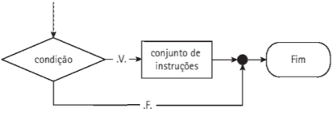
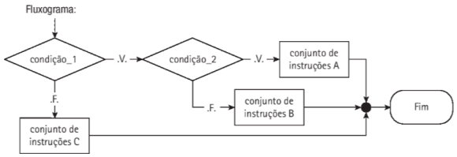

# 4 Construção de algoritmos: Estruturas de seleção

Ciclo de processamento de dados
Estrutura sequencial
Estruturas de seleção ou decisão

## 4.1 Ciclo de Processamento de dados

Algorítmos é uma sequência de passos computacionais que transforma a entrada em saída.

Ler (a, b)
resultado ← a + b
Mostrar (resultado)

### 4.1.1 Entrada de dados

A *entrada* elementar de dados é feita por meio do teclado (dispositivo padrão) e é representada da seguinte maneira em pseudocódigo:
	Ler (variavel)
Exemplo:
	Ler (a, b)
Durante o processo, a sequência de caracteres que satisfaz a sintaxe de um interio (nesse exemplo) é convertida em um valor binário, que é armazenado na memória do computador, na posição reservada para a variável inteira.

### 4.1.2 Processamento de dados

Execução das operações para a manipulação de dados, de acordo com os requisitos para resolução do problema. Exemplo:
	Resultado &#8592; a + b  

### 4.1.3 Saída de dados
 levantamento da necessidade de materiais de construção,
O dispositivo padrão de saída de dados é a tela do computador, e a instrução, em pseudocódigo, para gerar esta saída é representada por:
	Mostrar (variável)
Exemplo:
	Mostrar ("O resultado da soma é", resultado)

## 4.2 Estrutura Sequencial
É aquela em que as intrguções do algoritmo são realizadas uma após a outra, sem que ocorram desvios no fluxo de instruções. Exemplos:
**Pseudocódigo**
```
1. Algoritmo Primeiro
2. Início
3.	Mostrar ("Alô Mundo!")
4. Fim.
```

** C# (Saída via linha de comando)
```
1. Console.WriteLine("Alô mundo!");
```

**Pseudocódigo**
```
1. Algoritmo Exemplo4_3
2. Var
3.	nome: literal
4. Início
5.	Mostrar ("Qual o seu nome?")
6.	Ler (nome)
7.	Mostrar ("Seu nome é: ", nome)
8. Fim.
```
Linha 2 e 3 estão a declaração da variável para armazenamento do nome do usuário.

**Fluxograma**


**Pseudocódigo**
```
1. Algoritmo Exemplo4_4
2. Var
3.	valor1, valor2, soma : inteiro
4. Início
5.	Mostrar ("Qual o primeiro valor?")
6.	Ler (valor1)
7.	Mostrar ("Qual o segundo valor?")
8.	Ler (valor2)
9.	soma &#8592 valor1 + valor2
10.	Mostrar ("Resultado: ", soma)
11. Fim.
```

**Fluxograma**


## 4.3 Estruturas de Seleção ou Decisão

Utilizadas para verificar condições para determinar quais instruções serão, ou não, executadas. Podem também ser utilizadas para opções de escolha.

Podem ser simples, compostas ou encadeadas.

### 4.3.1 Estruturas de seleção simples

Utilizada para verificar se dada condição é considerada verdadeira, e, se for, um conjunto de instruções é executado; senão, o fluxo de execução do algoritmo seguirá após o fim do bloco de seleção.

**Pseudocódigo**
	Se (condição) então [início do bloco de seleção]
		conjunto de instruções
	Fim-se 				[fim do bloco de seleção]


**Fluxograma**



C#:

if (condição)
{
	<conjunto de instruções>
}

**Exemplo - Pseudocódigo**
1. Algoritmo Exemplo4_5
2. Var
3. 		numero: inteiro
4. Início
5. 		Mostrar ("Número: ")
6.		Ler (numero)
7. 		Se (numero mod 2=1) Então
8. 			Mostrar ("O número é ímpar.")
9. 		Fim-Se
10. Fim.

**Exemplo - C#**
```
int numero;
Console.WriteLine("Digite um número: ");
numero = Convert.ToInt32(Console.ReadLine());

if (numero % 2 == 1)
{
    Console.WriteLine("O número é ímpar");
}
```


### 4.3.2 Estruturas de Seleção Compostas

A estrutura deseleção composta prevê dois conjuntos de instruções para serem realizadas de
acordo com a avaliação da condição: um conjunto de instruções que será executado quando
a condição obtiver o resultado verdadeiro e um conjunto de instruções para resultado falso.

**Pseudocódigo:**

1. Algoritmo Exemplo
2. Var
3. 		numero: inteiro
4. Início
5. 		Mostrar ("Número: ")
6.		Ler (numero)
7. 		Se (numero mod 2=1) Então
8. 			Mostrar ("O número é ímpar.")
9.		Senão
10.			Mostrar ("O número é par.")
11. 	Fim-Se
10. Fim.

**C#**
```
int numero;
Console.WriteLine("Digite um número: ");
numero = Convert.ToInt32(Console.ReadLine());

if (numero % 2 == 1)
{
    Console.WriteLine("O número é ímpar");
}

else
{
    Console.WriteLine("O número é par");
}
```


### 4.3.3 Estruturas de Seleção Encadeadas

Uma estrutura de seleção encadeada é formada pela combinação de estruturas de seleção
simples ou compostas, uma dentro da outra, não havendo limite para o número de combinações, podendo, em alguns casos, gerar um código bastante complexo.

**Pseudocódigo:**

```
Se (condição_l) então
	Se (condição_2) então 
		conjunto de instruções A
	Senão
		conjunto de instruções B >
	Fim-Se
Senão
	conjunto de instruções C
Fim-Se
```

No pseudocódigo apresentado, se a avaliação da condiçào_l resultar verdadeiro, então será realizado o teste da condiçâo_2, que, dependendo do resultado, pode executar o
conjunto de instruções A ou B. Se, por outro lado, a condiçào_l for falsa, então,
será executado o conjunto de instruções C. É importante observar que somente um dos
conjuntos de instruções (A, B ou c) será executado. (veja a Figura abaixo).

**Fluxograma**



### 4.3.4 Estruturas de seleção de Múltipla Escolha

Uma estrutura de seleção de múltipla escolha, também denominada estrutura de seleção
homogênea, é uma estrutura de seleção que funciona como um conjunto de opções. Existem
duas maneiras para representá-la: utilizando o encadeamento da instrução Se ou a instrução
Escolha Caso, sendo esta última a mais indicada.

**Estrutura com seleção de múltipla escolha em pseudocódigo:**

1. Ler(variavel)
2. Escolha variavel
3. 		Caso valor_l:
4. 			conjunto de instruções A
5. 		Caso valor_2:
6. 			conjunto de instruções B
7. 		Caso valor_3s
8. 			conjunto de instruções C
9. 		Caso Contrário:
10. 		conjunto de instruções D
11. Fim-Escolha

**Fluxograma**


**C#**
```
switch(expression) 
{
  case x:
    <conjunto de instruções>;
    break;
  case y:
    <conjunto de instruções>;
    break;
  default: 
    <conjunto de instruções - caso nenhuma comparação resulte verdadeiro>;
    break;
}
```

## 4.4 Exercícios para fixação
