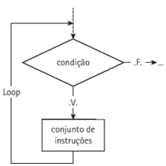
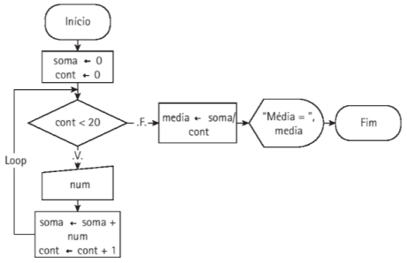
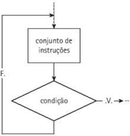
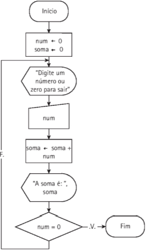
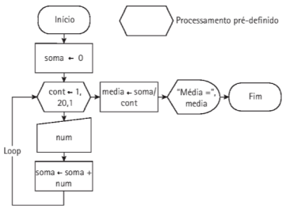

# 5. Construção de algoritmos: estruturas de repetição

## 5.1 Princípio de uma estrutura de repetição

O princípio de uma estrutura de repetição é a execução de um conjunto de
ações uma vez, várias vezes ou nenhuma vez, dependendo de uma condição verdadeira ou falsa, resultado booleano da avaliação de uma expressão. Essa condição é
chamada de ***expressão de controle*** ou ***condição*** deparada e está associada a um bloco
de instruções.
Sua aplicação pode ser associada a determinadas situações nas quais temos que
repetir o programa, ou pane dele, várias vezes, como acontece para o cálculo das
médias das notas de um grupo de alunos. Reiniciar o programa para cada cálculo
não c uma solução muito prática c, algumas vezes, inclusive inviável; nesses casos,
é mais adequada a utilização de estruturas de repetição, também conhecidas como
laço ou loop.
Estas estruturas nem sempre possuem recursos para fazer o controle do número de vezes em que o laço deverá ser executado, ***necessitando de uma variável de controle***, preferencialmente do tipo inteiro, funcionando como um contador e
garantindo que o número de repetições seja finito, conforme o trecho em pseudo-código a seguir:
```
var
    contador : inteiro
Início
    contador - 0
...
    contador ← contador + 1
```

Na expressão contador *- contador + 1, temos a variável de controle **contador**, do
tipo inteiro, incrementada em 1, toda vez que a instrução for executada. O incremento pode
ser um número diferente de 1, dependendo da finalidade do algoritmo, e assumir, inclusive,
um valor negativo, como em contador - contador - 1, quando então dizemos tratarse de um decremento. E importante lembrar que, na declaração de uma variável numérica,
definimos seu nome, porém, seu valor é atribuído automaticamente como nulo; desse modo,
para que possa ser utilizada em operações, a variável deve receber um valor, como realizado
pela instrução contador «- 0.

Em algumassituações, precisamos fazer a somatória de valores para realizaroutras operações,
como o cálculo da média aritmética, quando algo similar ao contador pode ser utilizado. Para
isso, podemos declarar uma variável de apoio, do tipo inteiro ou real, de acordo com os valores
que serão acumulados.
```
Var
    acumulador: real
    valor: real
Início
    acumulador ← 0
    ...
    acumulador ← acumulador + valor
```

## 5.2 Estrutura de repetição com teste no Início: Enquanto

Na estrutura enquanto, a execução de uma ou mais instruções de um bloco, ou laço,
depende de uma condição de controle verificada no início ou na entrada do laço. Enquanto
o resultado da condição for verdadeiro, o bloco de instruções é executado, caso contrário,
ocorre o desvio para a primeira linha após este bloco.

**Pseudocódigo**
    Enquanto (<condição>) faça
        <conjunto de instruções>
    Fim-Enquanto

**Fluxograma**



**C#**
```
while (<condição>)
{
    // conjunto de instruções
}
```

É importante observar que, para terminar a execução do comando while, **dentro do bloco de instruções do laço deve existir uma operação que modifique o valor da variável**
de controle, de modo que, em algum momento, a condição resulte falsa. Se isto não
acontecer, o processo de repetição ocorrerá indefinidamente e a execução do programa
nunca terminará.

Pseudocódigo
```
1. Algoritmo Exemplo5_l
2. Var
3.      soma, num, medias real
4.      cont: inteiro
5. Início
6.      soma <- 0
7.      cont <- 0
8.      Enquanto (cont < 20) faça
9.          Ler (num)
10.         soma <- soma + num
11.         cont <- cont + 1
12.     Fim-Enquanto
13.     media <- soma / cont
14.     Mostrar ("Média = ", media)
15. Fim
```
A variável cont tem a função de contador, armazenando o número de vezes que as
instruções dentro do laço são repetidas. A variável soma tem a função de acumular todos os
valores da variável num, atribuídos por meio da leitura da entrada pelo teclado.
O trecho entre as linhas 8 e 12 é o conjunto de instruções que será repetido, enquanto
a condição da linha 8 (cont < 20 ) resultar verdadeiro.

**Fluxograma**



**Exemplo em C#**

```
double num, media;
int cont = 0;
double soma = 0;

while (cont < 20)
{
    num = Convert.ToDouble(Console.ReadLine());
    soma = soma + num;
    cont++;
}

media = soma / cont;

Console.WriteLine($"A média é:  {media}");
```

## 5.3 Estrutura de repetição com Teste no Fim: Repita

A estrutura de repetição com teste no fim permite que um ou mais comandos de um
bloco sejam executados pelo menos uma vez, podendo ocorrer repetidas vezes, **até que uma condição específica seja verdadeira**. Essa estrutura atua de forma muito semelhante à anterior, contudo, os comandos do laço são executados antes do teste da condição de controle;
assim, como a condição é testada no final, os comandos na estrutura serão executados pelo
menos uma vez antes que a condição seja avaliada.

**Pseudocódigo**
```
Repita
    //conjunto de instruções
    Até (condição)
```

**Fluxograma**



**C#**
```
do
{
    //algoritmos
} while (condição)
```

O loop do {} while (condição) é executado enquanto a condição for verdadeira. 

**Pseudocódigo:**
```
1. Algoritmo Exemplo5_2
2. Var
3.      num, soma: real
4. Início
5.      num -* 0
6.      soma -* 0
7.      Repita
8.          Mostrar ("Digite um número ou zero para sair")
9.          Ler num
10.         soma = soma + num
11.         Mostrar ("A soma é: ", soma)
12.      Até (num = 0)
13. Fim.
```

O conjunto de instruções das linhas 6 a 11 será executado até que a condição especificada na linha 12 seja satisfeita, isto é, até que a variável num tenha um valor igual a 0.

**Fluxograma**



**C#**
```
double num, soma = 0;

do
{
    Console.WriteLine("Digite um número ou zedo para sair");
    num = double.Parse(Console.ReadLine());

    soma += num;

    Console.WriteLine("A soma é: " + soma);

} while (num != 0);
```
A condição de controle para a implementação em C#, precisou ser modificada, visto que o conjunto de instruções é executado, enquanto a avaliação da expressão
resultar verdadeiro. Observe que, no pseudocódigo deste exemplo, linha 12, a condição
utilizada foi (num = 0), significando que o laço de instruções é executado até que ela se
torne verdadeira.

## 5.4 Estrutura de repetição com variável de controle: Para

A estrutura de repetição Para utiliza uma sintaxe em que são definidos a variável de
controle, a atribuição inicial, o número de vezes que a sequência de instruções do bloco será
executada e, ainda, qual é o valor de incremento dessa variável, sendo que, este último é
tratado pela própria estrutura.

**Pseudocódigo:**
```
Para <var> «- <inicial> Até <final> passo <incremento> faça
<Bloco de instruções>
Fim-Para;
```

Neste código, var representa a variável de controle, inicial o valor de inicialização
desta variável, final o valor máximo que ela assume e incremento o número que será
acrescido à variável de controle, durante a execução.

**C#**
```
for (variável = inicial; condição ; incremento) 
{
  // code block to be executed
}
```

Pseudocódigo:
```
1. Algoritmo Exemplo5_3
2. Var
3.      soma, num, media: real
4.      cont: inteiro
5. Início
6.      soma <- 0
7.      Para cont <- 1 Até 20 Passo 1 faça
8.          Ler (num)
9.          soma <- soma + num
10.     Fim-Para
11.     media <- soma / cont
12.     Mostrar ("Média= ", media)
13. Fim.
```
Na linha 7, temos: cont, a variável de controle, também chamada de contador; 1, o
valor inicial da variável; 2 0, o valor final que cont poderá assumir; e 1, o passo ou número
de incremento do contador. Desse modo, a variável de controle irá variar de 1 até 20, quando as instruções do laço (linhas 8 e 9) deixarem de ser repetidas.

**Fluxograma**



**C#**
```
float numero, media, soma;
int cont = 0;
soma = 0;

for (cont = 0; cont < 3; cont++)
{
    Console.WriteLine("Digite o número ");
    numero = float.Parse(Console.ReadLine());
    soma = soma + numero;
}

media = soma / cont;

Console.WriteLine($"A média é: {media}");
```

Aqui, o incremento determinado por cont++ é equivalente a cont = cont + 1,
definindo o passo, que poderia ser outro, como cont +=2, indicando que a contagem seria
feita de dois em dois números. Outra observação importante é que não existe, no bloco de
instruções, uma operação de incremento da variável de controle, como ocorre com a estrutura while, pois, aqui, é desnecessária.
A variável cont foi declarada fora da estrutura de repetição for, para que o seu valor fique armazenado e servi para determinar a média. Caso não fosse feito isso, seu valor seria sempre 0.

## 5.5 Exercícios para fixação
