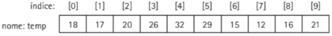
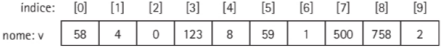

# Estruturas estáticas e dados

Objetivos de aprendizagem
Estudar as estruturas de dados estáticas e homogêneas, vetores e matrizes, bem como as operações que elas suportam, compreendendo sua importância e aplicação nos algoritmos; conhecer técnicas de programação usando
tais estruturas em algumas aplicações básicas.

## 6.1 Estruturas estáticas de dados
Existem casos em que precisamos armazenar
nâo apenas um valor, mas um conjunto deles.
Existe a necessidade de manipular os dados de forma associada, tarefa simplificada pelo uso de
estruturas estáticas de dados.
É possível criar uma variável para cada valor ou uma estrutura que permita armazenar c tratar esse conjunto de maneira associada, ou referenciar cada um
de seus elementos, facilitando o acesso.

## 6.2 Estruturas indexadas, denvaminadas Vetor ou Array

Uma estrutura indexada é um conjunto de elementos de dados do mesmo tipo acessados por meio de índices, equivalentes à sua posição nessa estrutura.
Um exemplo básico desse tipo de estrutura é a estrutura indexada simples (unidimensional) com dados do mesmo tipo, denominada vetor ou array, que necessita de apenas um
índice para identificar um determinado elemento nela armazenado.
Um vetor pode ser representado como uma linha de contêineres ou espaços predefinidos, identificados por índices.
Na Figura abaixo temos um vetor de números inteiros.



Desta forma, vetor é uma coleção de variáveis do mesmo tipo, que compartilham do
mesmo nome, ocupando posições consecutivas de memória. Cada variável da coleção denomina-se elemento e é identificada por um índice. No exemplo da Figura acima, 26 é o **elemento**
com o **índice 3**, do vetor denominado **temp**.
Para manipularmos um determinado elemento em um vetor, precisamos fornecer seu
identificador e o índice do elemento desejado, índice este que determina a posição na qual
o elemento está inserido. Cada posição do vetor contém exatamente um valor que pode ser
manipulado individualmente, sendo que a dimensão (o tamanho) e os índices que indicam
o elemento selecionado são definidos por números inteiros.

### 6.2.1 Declaração de um vetor

Pseudocódigo:
V : vetor [0..N] de inteiros

Esta declaração define uma variável chamada V, que pode armazenar um conjunto de
números inteiros identificados como V[0],V[l],V[2],..., V[N]. Temos, então, um conjunto de números inteiros, cada qual em um endereço sequencial diferente, identificado
pelo índice do vetor. Desta forma, V [ 0 ] guarda o primeiro número inteiro, V [ 1 ] guarda o
segundo e assim sucessivamente, até V[N], que contém o último número armazenado. Podemos dizer que V[ i] (lê-se “v índice i”) guarda o i-ésimo elemento do vetor V e, supondo que este vetor tenha dez elementos, recebe os seguintes valores: 58, 4, 0, 12 3, 8, 59, 1, 500,
758 e 2, como mostra a Figura abaixo:



Um elemento do vetor V é referenciado pelo nome do vetor e por seu índice; assim, o
4® elemento, que corresponde ao valor 12 3, é referenciado por V[3].

Em C# a declaração do vetor é mediante a definição do tipo acrescentando-se colchetes e do identificador:

tipo[] nomeVetor;

Os vetoressão objetos que permitem o uso de atributos (propriedades) e a aplicação de métodos. Com isso, além da declaração, é necessário criar esse objeto na memória, determinando
seu tamanho, para poder utilizá-lo. Essa criação pode ser feita utilizando-se o operador new.

Em C#:

tipo[] nomeVetor = new tipo[n];

ou

tipo[] nomeVetor;
nomeVetor = new tipo[n];

Exemplo:
```
int[] vetorInteiros = new int[10];

ou através da inicialização direta:

int[] vetorInteiros = new int[1, 2, 3, 4, 5, 6, 7, 8, 9, 10];
```

### 6.2.2 Acesso e atribuição de dados em vetores

A partir da criação de um vetor, a atribuição de dados é processada, de elemento em
elemento, alterando-se o valor de seu índice.
```
V : vetor [0..N] de inteiros
V[0] <- <valor0>
V[l] <- <valorl>
...
V[N] <- <valorN>
```

A seguir, exemplo de um vetor usado para guardar os nomes dos meses do ano:

Pseudocódigo
```
meses : vetor [0..11] de literais
meses [0] <- "janeiro"
meses [1] <- "fevereiro"
...
meses [10] <- "novembro"
meses [11] <- "dezembro"
```

C#
```
string[] meses = new string[12];

meses[0] = "janeiro";
meses[1] = "fevereiro";
//...
meses[10] = "novembro";
meses[11] = "dezembro";
```

Em geral, um vetor pode ser indexado com qualquer expressão, cujo valor de retorno
seja um número inteiro, podendo ser uma simples constante, uma variável, ou, então, uma
expressão contendo operadores aritméticos, constantes e variáveis. Desta forma, um vetor
não precisa terseu tamanho previamente definido pelo programador, podendo ser calculado pelo programa em tempo de execução.

```
int tamanho = ... ; // algum cálculo para tamanho
int[] n = new int [tamanho];
