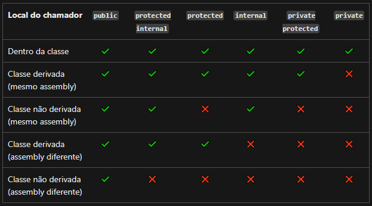
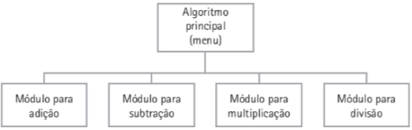
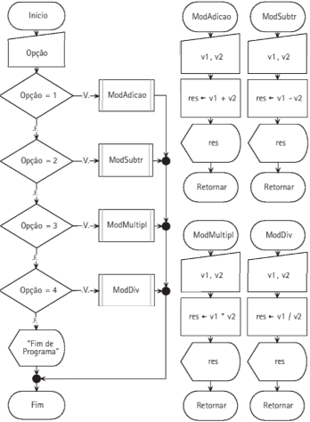
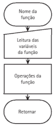
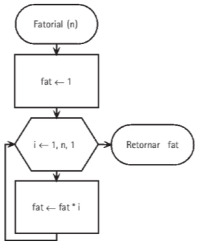

## 7.1 Técnica da modularização
A programação estruturada consiste na divisão de uma tarefa em panes, cada uma
delas responsável por uma atividade. Desta forma, compreender o problema torna-se
mais simples e, como consequência, a extensão dos programas diminui, de maneira que,
se alguma alteração ou acerto forem necessários, isso poderá ser feito mais rapidamente.
A cada uma dessas partes é dado o nome de módulo e a modularização é a técnica
utilizada para desenvolver algoritmos, dividindo o problema em partes, por meio de
refinamentos sucessivos.

Um refinamento sucessivo refere-se à redução de um problema a um conjunto de
tarefas destinadas a solucioná-lo, de maneira eficiente. Para cada tarefa, desenvolve-se
um algoritmo (programa) que poderá ser utilizado na solução de outros problemas,
pois cada módulo é independente. O gerenciamento das tarefas é feito pelo algoritmo
principal ou, módulo principal, que “chama” ou aciona os outros módulos, que deverão scr escritos por meio de funções ou procedimentos.

## 7.2 Procedimentos

Um procedimento (procedure), também conhecido como sub-rotina, é um conjunto de
instruções que realiza uma determinada tarefa. Um algoritmo de procedimento é criado da
mesma maneira que outro algoritmo qualquer, devendo: ser identificado e possuir variáveis,
operações e até funções.

**Pseudocódigo**
```
Procedimento nome_do_procedimento (lista de parâmetros)
Var
    <declaração das variáveis do procedimento> // variáveis locais
Início
    <instruções do procedimento>
Fim nome_do_procedimento.
```

**C#**
Em C#, os módulos, sejam eles procedimentos ou funções, são representados por classes ou métodos. Para escrever um método em C#, representando procedimentos ou funções, utiliza-se a seguinte sintaxe:
```
<nívelDeAcesso> <ModificadoresOpcionais> <TipoDeRetorno> <nomeDoMetodo> (parâmetrosDeMétodo, separadosPorVírgula)
{
    <instruções>
}
```

Onde:
Nível de Acesso: 
    
    public: pode ser invocado livremente e indica um método que é visível para qualquer um que "enxergue" a classe.
    
    private: o tipo ou membro pode ser acessado somente pelo código na mesma class ou struct.

    protected: o tipo ou membro pode ser acessado somente pelo código na mesma class ou em uma class derivada dessa class.

    internal: o tipo ou membro pode ser acessado por qualquer código no mesmo assembly, mas não de outro assembly. Em outras palavras, tipos ou membros internal podem ser acessados no código que faz parte da mesma compilação.

    proteted internal: o tipo ou membro pode ser acessado por qualquer código no assembly no qual ele é declarado ou de uma class derivada em outro assembly.

    private protected: o tipo ou membro pode ser acessado por tipos derivados do class, que são declarados no assembly relativo.

**Tabela de resumo**



- Modificadores de Acesso:
    
    abstract: não pode ser instanciada (criado objeto), acesso aos membros da classe utilizando o nome da própria classe. 

    sealed: não pode ser usada como uma classe base. impedem a derivação.

- Tipo de Retorno: indica o tipo de dado que deverá ser retornado ao ambiente de chamada. **No caso de procedimento, o retorno é void**, indicando que não há retorno de valor.

- Argumentos: são os valores (variáveis, constantes, funções) que serão passados como parâmetros para o método.

### 7.2.1 Chamada de Procedimentos

Momento em que o procedimento é acionado e seu código executado, podendo ocorrer a passagem, ou não, de parâmetros. A execução do código em que o procedimento é chamado é interrompido e o controle é passado para o procedimento, até que ele seja finalizado, e o controle de execução volta para quem o chamou.

**Pseudocódigo**

Algoritmo Principal //nome do algoritmo principal

```
Procedimento nome_do_procedimento (lista de parâmetros)
Var
    <declaração de variáveis do procedimento>
Início
    <instruções do procedimento>
Fim nome_do_procedimento.


Var
    <declaração de variáveis do algoritmo principal>
Início
    <instruções do algortmo principal>

    <nome_do_procedimento> (lista_de_parâmetros) //chamada do procedimento

    Fim.        //fim do algoritmo principal
```

## Exemplo 

Elaborar um algoritmo que realize a operação aritmética escolhida pelo usuário, a saber
adição, subtração, multiplicação ou divisão, apresentando uma mensagem com o resultado obtido. Criar um menu de opções para o usuário no algoritmo principal e módulos com
procedimentos para a realização das operações, conforme o diagrama da Figura abaixo:



**Pseudocódigo**
```
1. Algoritmo Exemplo7_l
2.  Procedimento ModAdicao  // início do procedimento
3.      Var vl, v2, res: real
4.  Início
5.      Ler (v1, v2)
6.      res <- vl + v2
7.      Mostrar (res)
8.  Fim ModAdicao. //fim do procedimento
9.  Procedimento ModSubtr
10.     Var vl, v2, res: real
11. Início
12.         Ler (vl, v2)
13.         res <- vl - v2
14.         Mostrar (res)
15. Fim ModSubtr.
16. Procedimento ModMultipl
17.     Var vl, v2, res: real
18. Início
19.     Ler (vl, v2)
20.     res >- vl * v2
21.     Mostrar (res)
22. Fim ModMultipl.
23. Procedimento ModDiv
24.     Var vl, v2, res: real
25. Início
26.     Ler (vl, v2)
27.     res <- vl / v2
28.     Mostrar (res)
29. Fim ModDiv.
30. Var opcao: inteiro //algoritmo principal
31. Início
32.     Ler (opcao)
33.     Escolha opcao
34.         Caso 1: faça ModAdicao
35.         Caso 2: faça ModSubtr
36.         Caso 3: faça ModMultip
37.         Caso 4: faça ModDiv
38.         Caso contrário: Mostrar ("Fim de Programa")
39.     Fim-Escolha
40. Fim. //fim do algoritmo
```

**Fluxograma**



## 7.3 Funções

As *Funções* são criadas e chamadas da mesma maneira que os procedimentos. **A diferença entre eles é que as funções  podem ser utilizadas em expressões, como se fossem variáveis, pois retornam valores que são associados ao seu nome**. Para esses valores, faz-se necessária a
declaração do tipo de dado a ser retornado:

```
Função nome_da_função (lista de parâmetros): tipo_de_retorno_da_função
Var
    Declaração das variáveis pertencentes a função (variáveis locais)
Início
    Operações/Instruções da função
Retornar (variável)
Fim nome_da_função
```


*"Tanto os procedimentos como as funções são "minialgoritmos que  possuem variáveis e até mesmo outros  procedimentos e funções."*

**Fluxograma:**



**C#**
Os métodos para representação de funções têm uma sintaxe muito parecida com a
utilizada para representação dos procedimentos. O que os difere é a especificação do tipo
de retorno e da instrução return, já que as funções devem, obrigatoriamente, retornar um
valor à rotina chamadora

```
<modificadores> <tipo_retorno> <nome_método> (<argumentos>)
{
    <instruções>;
}
```

```
<modificadores>:são elementos que caracterizam o método quanto ao acesso e à visibilidade e são os mesmos mencionados para os procedimentos. Os métodos, bem como as
classes e as variáveis, podem possuir mais de um modificador, não importando sua ordem.
<tipo_retorno>: indica o tipo de dado que deverá ser retornado ao ambiente de
chamada (void indica que não há retorno).
<nome_método>: é um identificador válido da linguagem, obedecendo às mesmas regras que os identificadores de classe, objeto e variável.
<argumentos>: indica a lista de argumentos passados como parâmetros para o método. A sintaxe dos argumentos é a de declaração de variáveis: tipo identificador e os vários
parâmetros são separados por vírgulas.
return: palavra reservada que indica o valor que será devolvido para o programa, sendo associada com a variável que armazena este valor. No caso de um método com tipo de
retorno void, nada é devolvido, portanto, não se deve utilizar a instrução return, o que
constituiría um erro.
```

**Pseudocódigo**

```
1. Função Fatorial(n : inteiro) : inteiro
2. Var
3.      i, fat: inteiro
4. Início
5.      fat <- 1
6.      Para i de 1 até n Passo 1 faça
7.          fat «- fat * i
8.      Fim-Para
9.      Retornar (fat)
10. Fim Fatorial.
```

**Fluxograma**



**C#**
Arquivo de funções.


