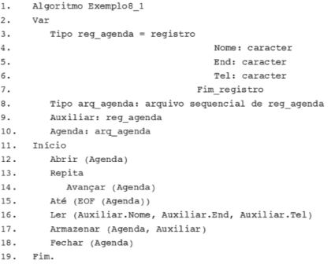

# Acesso a arquivos e à base de dados

# 8.1 Persistência de dados

Dados mantidos em arquivossão chamados depersistentes porque continuam existindo, após o encerramento da execução do programa, gravados em dispositivos de
armazenamento secundários, como disquetes, discos rígidos, discos ópticos, unidades
de estado sólido etc.
Até agora, os exemplos apresentados armazenavam as informações, temporariamente, na memória RAM do computador.
Para que as informações possam ser utilizadas posteriormente, elas precisam ser
transferidas para meios físicos de armazenamento, guardadas em arquivos ou banco
de dados. A principal diferença entre tais meios está relacionada à organização do armazenamento, ao acesso e à recuperação dos dados.

## 8.2 Arquivo-Texto

As informações de um arquivo-texto são reunidas em registros, sendo que estes, por sua
vez, são organizados em campos, no qual inserem-se os dados.

## 8.3 Tipos de arquivo quanto às formas de acesso

Escrever dados em arquivos pressupõe a possibilidade de ler, alterar, escrever e apagar,
operações básicas de manipulação, que requerem o estabelecimento de formas de acesso.
Basicamente, podemos considerar duas possibilidades: o acesso sequencial e o acesso aleatório (ou randômico).


### 8.3.1 Arquivos Sequenciais

São gravados na ordem em que são digitados. Apresentam muitos inconvenientes.

Não sendo recomendado para trabalhos com grande volume e informações, pois é lento. Não é possível abri-lo para leitura e escrita.

No entanto, em muitos casos pode ser usado: como em registros de log e históricos, quando há recursos limitados, processamento de dados em lote, e pequenas aplicações locais.

### 8.3.2 Arquivos de acesso aleatório

Os arquivos de acesso aleatório (ou randômico) também armazenam as informações no
formato ASCII. Cada registro é gravado em uma posição específica e, assim, asinformações
podem ser lidas independentemente da ordem em que foram inseridas.
Também chamaos de arquivo de acesso direto.

## 8.4 Operações de Manipulação de arquivos sequenciais.
As quatro operações Básica, CRUD:

Create
Read
Update
Delete

### 8.4.1 Operação de inclusão em arquivo sequencial

Os arquivos-texto não impõem qualquer estrutura para o armazenamento das informações, cabendo ao programador estruturar os registros com campos e tipos de dados necessários aos requisitos da aplicação que precisa desenvolver. Para que seja possível manipular
arquivos sequenciais, será necessário:
1) Declarar o registro e o arquivo.
2) Declarar as variáveis de arquivo e registro.
3) Abrir o arquivo.
4) Fechar o arquivo.

Estes passos são utilizados para qualquer operação de manipulação de arquivos, tais
como inclusão, consulta, alteração e exclusão e serão explicados nos exemplos a seguir.

**EXEMPLO 8.1**
Construção de uma agenda que armazene nomes, endereços e telefones, com a operação
de inclusão em arquivo sequencial.

**Pseudocódigo**



EOF: Sigla para End Of File (fim de arquivo).

Nos algoritmos, deve ser declarada, primeiro, uma estrutura do tipo registro, com todos os campos, cujas informações pretende-se armazenar conforme trecho das linhas 3 a 7 do exemplo acima.
Declarar um identificador do tipo arquivo, mencionando o tipo de arquivo que será utilizado (nesse caso sequencial).
O identificador é associado ao arquivo formado pelos registros de reg_agenda.

Para que seja possível a manipulação do arquivo, este deve ser aberto com a instrução:

    Abrir (nome da variável de arquivo)

Após a abertura do arquivo, será disponibilizado o primeiro registro armazenado e, para
acessar os próximos registros, utiliza-se a instrução:

    Avançar (nome da variável de arquivo)

No caso de se desejar que o arquivo seja posicionado no último registro, utiliza-se uma estrutura de repetição que execute o avanço pelos registros até o final do arquivo:

    Repita
        Avançar (nome da variável de arquivo)
    Até (EOF (nome da variável de arquivo))

Por se tratar de um arquivo sequencial, para se chegar ao último registro, percorre-se o arquivo todo,
passando por todos os registros armazenados.

Declaração da estrutura de dados do tipo registro:
```
Var Tipo reg_agenda = registro
                        Nome: caracter
                        End: caracter
                        Tel: caracter
                    Fim_registro
```

Declaração da variável do tipo registro que terá o mesmo formato da estrutura de dados
criada para o registro, isto é, Auxiliar.Nome, Auxiliar.End, Auxiliar.Tel:

    Auxiliar: reg_agenda

Preenchimento dos campos:

    Ler (Auxiliar.Nome, Auxiliar.End, Auxiliar.Tel)

Depois de representar o preenchimento dos campos, será necessário indicar a operação
de armazenamento do conteúdo no arquivo e, para isto, utiliza-se a instrução:

    Armazenar (nome da variável de arquivo, nome da variável de registro)
    Armazenar (Agenda, Auxiliar)

A variável de arquivo Agenda receberá o conteúdo da variável de registro Auxiliar.
Por último, o arquivo deve ser fechado, com a instrução:

    Fechar (nome da variável de arquivo)

**C#**

Para representar uma estrutura do tipo registro, em C#, utilizou-se uma classe
RegAgenda que possui como atributos: nome, end e tel. Esta forma de representação
é necessária, uma vez que C# trabalha orientado a objetos. Assim, cada entrada em
RegAgenda corresponde a um novo registro e refere-se a um novo objeto da classe,
que possui características próprias, isto é, um nome, um endereço e um telefone que o
distinga dos demais objetos existentes. Para exibir os atributos de cada novo objeto instanciado, criaram-se os métodos mostraNome(), mostraEnd() e mostraTel(), que retornam os valores dos atributos.


```
public class RegAgenda
{
    private string _nome;
    private string end;
    private string tel;

    public RegAgenda(string nome, string end, string tel)
    {
        _nome = nome;
        this.end = end;
        this.tel = tel;
    }

    public string MostrarNome()
    {
        return _nome;
    }

    public string MostrarEndereco()
    {
        return end;
    }
    
    public string MostrarTelefone()
    {
        return tel;
    }
}
```

