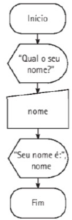
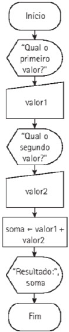

# 4 Construção de algoritmos: Estruturas de seleção

Ciclo de processamento de dados
Estrutura sequencial
Estruturas de seleção ou decisão

## 4.1 Ciclo de Processamento de dados

Algorítmos é uma sequência de passos computacionais que transforma a entrada em saída.

Ler (a, b)
resultado ← a + b
Mostrar (resultado)

### 4.1.1 Entrada de dados

A *entrada* elementar de dados é feita por meio do teclado (dispositivo padrão) e é representada da seguinte maneira em pseudocódigo:
	Ler (variavel)
Exemplo:
	Ler (a, b)
Durante o processo, a sequência de caracteres que satisfaz a sintaxe de um interio (nesse exemplo) é convertida em um valor binário, que é armazenado na memória do computador, na posição reservada para a variável inteira.

### 4.1.2 Processamento de dados

Execução das operações para a manipulação de dados, de acordo com os requisitos para resolução do problema. Exemplo:
	Resultado &#8592; a + b  

### 4.1.3 Saída de dados
 levantamento da necessidade de materiais de construção,
O dispositivo padrão de saída de dados é a tela do computador, e a instrução, em pseudocódigo, para gerar esta saída é representada por:
	Mostrar (variável)
Exemplo:
	Mostrar ("O resultado da soma é", resultado)

## 4.2 Estrutura Sequencial
É aquela em que as intrguções do algoritmo são realizadas uma após a outra, sem que ocorram desvios no fluxo de instruções. Exemplos:
**Pseudocódigo**
```
1. Algoritmo Primeiro
2. Início
3.	Mostrar ("Alô Mundo!")
4. Fim.
```

** C# (Saída via linha de comando)
```
1. Console.WriteLine("Alô mundo!");
```

**Pseudocódigo**
```
1. Algoritmo Exemplo4_3
2. Var
3.	nome: literal
4. Início
5.	Mostrar ("Qual o seu nome?")
6.	Ler (nome)
7.	Mostrar ("Seu nome é: ", nome)
8. Fim.
```
Linha 2 e 3 estão a declaração da variável para armazenamento do nome do usuário.

**Fluxograma**



**Pseudocódigo**
```
1. Algoritmo Exemplo4_4
2. Var
3.	valor1, valor2, soma : inteiro
4. Início
5.	Mostrar ("Qual o primeiro valor?")
6.	Ler (valor1)
7.	Mostrar ("Qual o segundo valor?")
8.	Ler (valor2)
9.	soma &#8592 valor1 + valor2
10.	Mostrar ("Resultado: ", soma)
11. Fim.
```

**Fluxograma**



## 4.3 Estruturas de Seleção ou Decisão